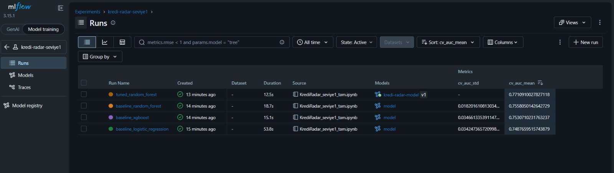
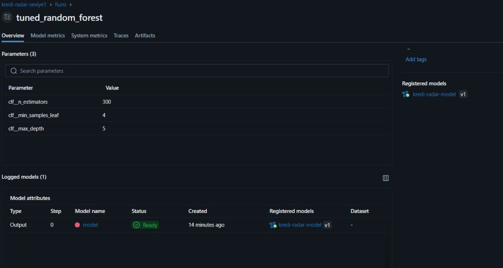
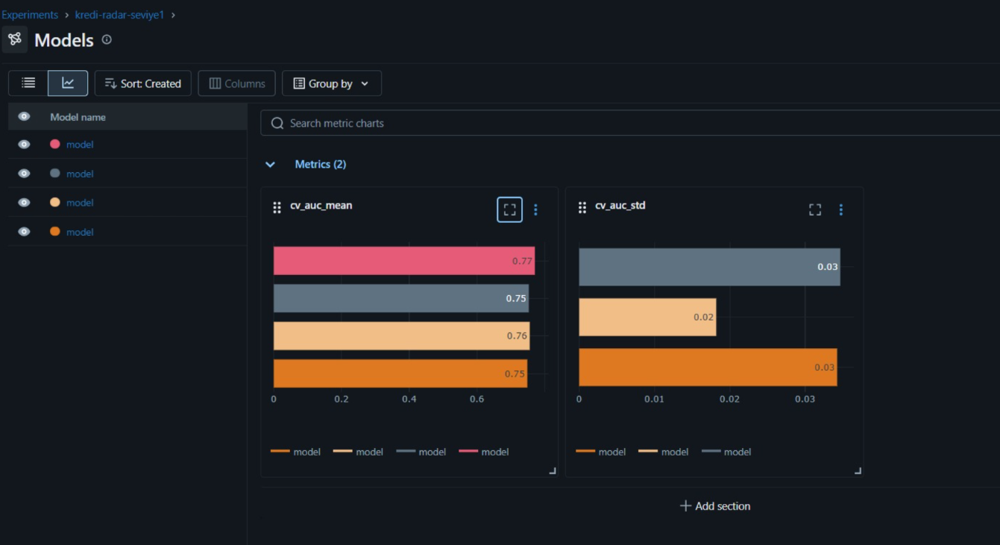
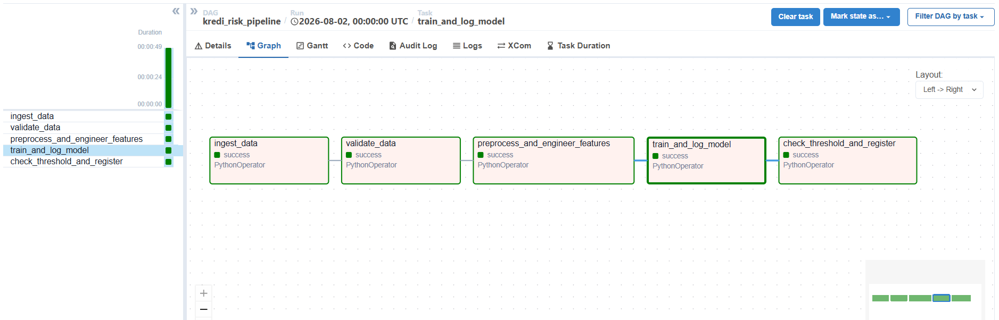
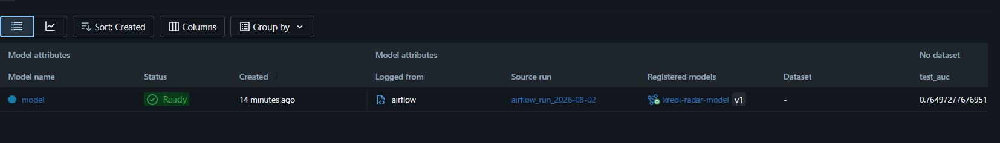
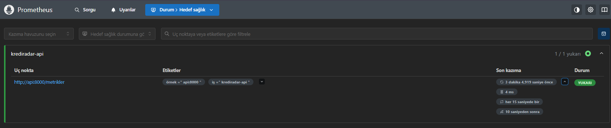
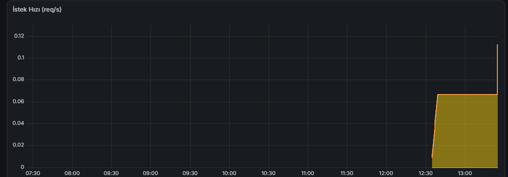
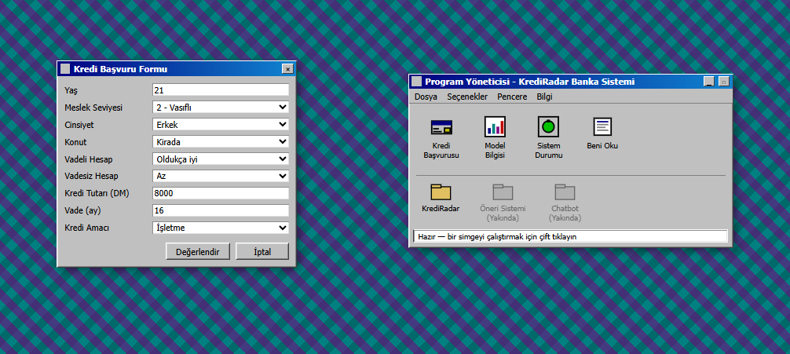
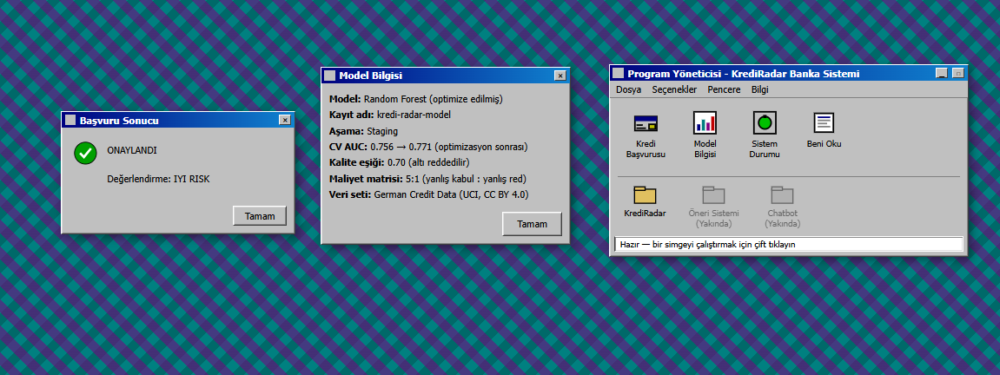

# KrediRadar 💳

Finans domaininde uçtan uca bir MLOps portföy projesi — kredi risk skorlaması, **MLflow** ile deney takibi ve model governance, **Apache Airflow** ile otomatik/zamanlanmış pipeline orkestrasyonu, **FastAPI** ile gerçek zamanlı model serving, **Prometheus + Grafana** ile monitoring, ve retro tarzda bir **frontend** üzerine kurulu.

## Proje Amacı

Bankaların kredi başvurularını değerlendirirken kullandığı türde bir modelin, **production disipliniyle** (deney takibi, otomatik pipeline, kalite eşiği kontrolü, model registry, gerçek zamanlı serving, monitoring) nasıl kurulacağını göstermek.

## Veri Seti

German Credit Data (Statlog) — UCI Machine Learning Repository, CC BY 4.0 lisanslı. 954 kayıt, kredi başvurularının "iyi risk / kötü risk" olarak sınıflandırılması.

## Mimari

Veri (CSV) → Airflow DAG → MLflow (deney takibi + model registry) → FastAPI (/predict) → Prometheus + Grafana → Frontend
ingest → validate → preprocess/feature engineering → train → threshold kontrolü → model export → REST API → metrik toplama + görselleştirme → kullanıcı arayüzü

- **Seviye 1 — Model Geliştirme:** Kapsamlı bir Jupyter notebook (EDA, istatistiksel testler, preprocessing, feature engineering, 3 model karşılaştırması, hiperparametre optimizasyonu, MLflow entegrasyonu, model değerlendirme)
- **Seviye 2 — Orkestrasyon:** Notebook'taki kararları otomatikleştiren bir Airflow DAG'ı (Docker Compose ile LocalExecutor + Postgres)
- **Seviye 3 — Model Serving:** MLflow registry'den (`kredi-radar-model`, Staging) çekilen modeli sunan bir FastAPI servisi. `/predict` endpoint'i, Pydantic ile input validasyonu, kendi Docker container'ında çalışıyor.
- **Seviye 4 — Monitoring:** FastAPI servisi `prometheus-fastapi-instrumentator` ile `/metrics` endpoint'i yayınlıyor. Prometheus bunu periyodik olarak topluyor, Grafana üzerinden istek hızı ve durum kodları görselleştiriliyor.
- **Seviye 5 — Frontend:** Windows 3.1 "Program Yöneticisi" estetiğinde, `/predict` ve `/health` endpoint'lerine bağlı çalışan bir arayüz (`frontend/index.html`). Bağımsız statik dosya, CORS ile FastAPI'ye bağlanıyor.

## Kullanılan Teknolojiler

| Kategori | Araç |
|---|---|
| Deney takibi & Model Registry | MLflow |
| Orkestrasyon | Apache Airflow (LocalExecutor) |
| Model Serving | FastAPI, Uvicorn |
| Monitoring | Prometheus, Grafana |
| Frontend | HTML/CSS/JS (statik, bağımsız) |
| Konteynerleştirme | Docker, Docker Compose |
| Modelleme | scikit-learn, XGBoost |
| İstatistik | SciPy, statsmodels |
| Açıklanabilirlik | SHAP |

## Öne Çıkan Teknik Kararlar

- **Eksik değer yönetimi:** Saving/Checking account sütunlarındaki eksik değerler MNAR olarak değerlendirildi — "no_account" kategorisi kullanıldı.
- **Model seçimi:** Logistic Regression, Random Forest ve XGBoost karşılaştırıldı; optimize edilen Random Forest en iyi sonucu verdi (CV AUC: 0.756 → 0.771).
- **Maliyet-duyarlı değerlendirme:** Resmi 5:1 maliyet matrisi kullanılarak optimal karar eşiği belirlendi.
- **Kalite kapısı:** Airflow DAG'ı, test AUC'si 0.70 eşiğinin altında kalan modeli reddedip Model Registry'ye kaydetmiyor.
- **Serving stratejisi:** FastAPI servisi, runtime'da MLflow registry'sine bağlanmak yerine, modeli build zamanında image içine gömüyor (`model_export/`) — bu hem başlatma süresini kısaltıyor hem de MLflow'a çalışma zamanı bağımlılığını kaldırıyor.
- **Monitoring stratejisi:** Prometheus, Grafana ile aynı Docker ağında çalışıyor; Grafana'nın Prometheus'a bağlanması `http://prometheus:9090` (container adı üzerinden), tarayıcıdan erişim ise `localhost` portları üzerinden yapılıyor.
- **Frontend stratejisi:** Arayüz, framework içermeyen tek bir statik HTML dosyası — herhangi bir build adımı gerektirmiyor, doğrudan tarayıcıda açılabiliyor. FastAPI'ye CORS ile bağlanıyor.

## Ekran Görüntüleri

### MLflow — Deney Karşılaştırması

### MLflow — Model Parametreleri

### MLflow — Model Registry

### Airflow — DAG Çalıştırması (5 Task Başarılı)

### Airflow ve MLflow Entegrasyonu

### Prometheus — Hedef Sağlığı

### Grafana — API İstek Hızı

### Frontend — Program Yöneticisi (Retro Arayüz)

### Frontend — Başvuru Sonucu

## Kurulum ve Çalıştırma

### Seviye 1 (Notebook)

    pip install -r requirements.txt
    jupyter notebook KrediRadar_seviye1_tam.ipynb

### Seviye 2 (Airflow Pipeline)

    docker-compose up airflow-init
    docker-compose up

Airflow arayüzü: http://localhost:8081 (admin/admin)

### Seviye 3 (Model Serving API)

    docker-compose up --build api

API: http://localhost:8000/docs (Swagger UI)
Health check: http://localhost:8000/health

Örnek istek:

    curl -X POST http://localhost:8000/predict \
      -H "Content-Type: application/json" \
      -d '{"Age": 35, "Job": 2, "Sex": "male", "Housing": "own", "Saving accounts": "little", "Checking account": "moderate", "Credit amount": 5000, "Duration": 24, "Purpose": "car"}'

### Seviye 4 (Monitoring)

    docker-compose up --build api prometheus grafana

Prometheus: http://localhost:9090 (Status → Target Health altında `krediradar-api` UP görünmeli)
Grafana: http://localhost:3000 (admin/admin) — Prometheus veri kaynağı `http://prometheus:9090` ile bağlanır, `/metrics` üzerinden toplanan istek hızı ve durum kodları izlenir.

### Seviye 5 (Frontend)

`frontend/index.html` dosyasını tarayıcıda doğrudan açın (API'nin `localhost:8000`'de çalışıyor olması gerekir). "Kredi Başvurusu" simgesine çift tıklayarak formu doldurup değerlendirme sonucunu görebilirsiniz.

## Yol Haritasının Devamı

Bu proje, daha geniş bir finans AI platformunun ilk modülü. Planlanan sonraki adımlar:
- CI/CD (GitHub Actions)
- Veri/model drift takibi (Evidently AI)
- Platform mimarisine geçiş: KrediRadar'ın yanına öneri sistemi ve chatbot modüllerinin eklenmesi, ortak altyapının (MLflow, Airflow, monitoring) modüller arasında paylaşılması

## Lisans / Veri Kaynağı

Veri seti CC BY 4.0 lisanslıdır. Bu proje eğitim/portföy amaçlıdır.